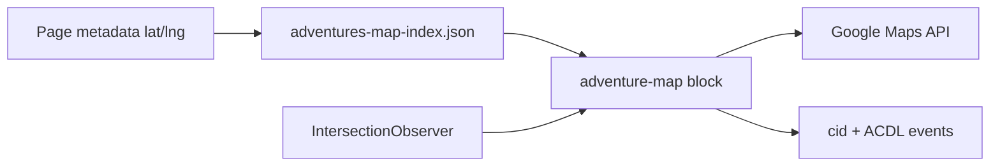

# Product Requirements Document: Adventure Map Block

| | |
|---|---|
| **Feature** | `adventure-map` EDS block |
| **Product** | WKND Adventures (masterclass-demo) |
| **Status** | Draft — ready for implementation |
| **Last updated** | June 2026 |
| **Related docs** | [Architecture plan](../.cursor/plans/adventure_map_block_e3d22a79.plan.md), [ANALYTICS-LAUNCH-PLAN.md](./ANALYTICS-LAUNCH-PLAN.md), [AGENTS.md](../AGENTS.md) |

---

## 1. Overview

### 1.1 Problem statement

WKND Adventures offers trips and field notes across global destinations, but visitors cannot visually explore where adventures take place. Location information today exists only as prose in hero eyebrows and planning copy (e.g. “Trekking · Patagonia”). There is no interactive map, no structured geo data, and no way to measure how map-driven discovery contributes to traffic.

### 1.2 Proposed solution

An **`adventure-map`** AEM Edge Delivery Services block that:

- Displays an interactive Google Map styled with WKND branding
- Plots adventure locations from **page metadata** (latitude, longitude, place name) indexed at publish time
- Filters visible pins to adventures within the **current map viewport** as users zoom and pan
- Opens a branded popup on pin click with a link to the adventure page
- Appends a trackable **`cid`** query parameter on outbound links for Adobe Analytics campaign attribution

### 1.3 Goals

| Goal | Measure |
|------|---------|
| Help users discover adventures by geography | Map interactions, pin clicks, outbound clicks with `cid=adventure-map` |
| Maintain WKND brand consistency on map UI | Branded map styles, accent pins, typography aligned with `styles/brand.css` |
| Zero impact on page performance | PSI baseline vs after — no regression on host page Core Web Vitals |
| Enable author-friendly geo maintenance | Coordinates editable in Universal Editor page metadata |
| Attribute map-driven traffic in Analytics | eVar1 (`cid`) on destination pages; ACDL `mapPinClick` events |

### 1.4 Non-goals (out of scope v1)

- Turn-by-turn directions or routing
- User geolocation (“find adventures near me”)
- Real-time availability or booking on the map
- Clustering algorithms beyond viewport bounds filtering
- Geocoding automation from free-text addresses at runtime
- Map in the first / LCP section of any page
- Replacing existing adventure listing blocks (`tabs-activity`, `carousel-blog`)

---

## 2. Users & personas

| Persona | Need |
|---------|------|
| **Prospective adventurer** | Browse where WKND trips happen; drill into a region; open a relevant adventure page |
| **Content author** | Add or update coordinates once per adventure page without duplicating pins in the map block |
| **Marketing / analytics** | Report how much traffic the map generates vs other discovery paths |
| **Developer** | Implement a block that follows EDS patterns, passes PSI gates, and degrades gracefully |

---

## 3. User stories

| ID | Story | Priority |
|----|-------|----------|
| US-1 | As a visitor, I want to see adventure locations on a world map so I can understand where WKND operates | P0 |
| US-2 | As a visitor, I want to zoom and pan the map so I can focus on a region and see only relevant adventures | P0 |
| US-3 | As a visitor, I want to click a pin and see adventure title, place, image, and a link to read more | P0 |
| US-4 | As a visitor on mobile, I want the map to load only when I scroll to it so the page stays fast | P0 |
| US-5 | As a visitor using a keyboard, I want a list alternative to map pins so I can reach adventure links | P1 |
| US-6 | As an author, I want to set latitude/longitude on each adventure page in metadata so the map stays in sync automatically | P0 |
| US-7 | As a marketer, I want map outbound links tagged with `cid` so I can measure map-attributed visits in Analytics | P0 |
| US-8 | As an author, I want to drop the map block on `/destinations` with minimal configuration (heading only) | P1 |

---

## 4. Functional requirements

### 4.1 Map display

| ID | Requirement |
|----|-------------|
| FR-1 | Block name: `adventure-map` |
| FR-2 | Map renders in a dedicated container with fixed min-height skeleton (360px mobile, 520px desktop) to prevent CLS |
| FR-3 | Map uses Google Maps JavaScript API with WKND JSON style overrides: surface `#f4f2ef`, text `#0f1a14`, accent `#e8651a`, minimized POI noise |
| FR-4 | Custom markers use WKND accent color (`#e8651a`) with dark stroke (`#0f1a14`) |
| FR-5 | Initial view fits bounds of all valid indexed adventures, or world zoom level 2 if fewer than two pins |
| FR-6 | Optional authored **default zoom** (number) in block config row |

### 4.2 Viewport filtering

| ID | Requirement |
|----|-------------|
| FR-7 | On map `idle` (after zoom/pan), show only markers whose lat/lng fall inside `map.getBounds()` |
| FR-8 | Markers outside bounds are removed from the map (`setMap(null)`) until the viewport includes them again |
| FR-9 | Optional UI: count label “Showing N adventures in this area” |
| FR-10 | Bounds updates are debounced via `idle` event, not continuous `bounds_changed` |

### 4.3 Pin popup (InfoWindow)

| ID | Requirement |
|----|-------------|
| FR-11 | Clicking a marker opens a popup with: adventure **title**, **placeName**, **adventureCategory** tag, **thumbnail** (from index `image`) |
| FR-12 | Popup includes primary CTA **“View adventure”** linking to the adventure page |
| FR-13 | CTA URL appends `?cid={analyticsCid}` (default `adventure-map`); configurable in block config |
| FR-14 | CTA uses existing `.button` class for WKND styling and global `ctaClick` analytics binding |

### 4.4 Data source

| ID | Requirement |
|----|-------------|
| FR-15 | Pins sourced from `/adventures-map-index.json` (helix-query index), not authored in the block |
| FR-16 | Index includes pages under `/blog/**`, `/destinations/**` (and `/drafts/blog/**` for local testing) |
| FR-17 | Only index rows with valid numeric `latitude` and `longitude` are plotted |
| FR-18 | Geo fields authored as **page metadata**: `latitude`, `longitude`, `placeName` |
| FR-19 | Invalid or missing coordinates are skipped silently (no console errors in production) |

### 4.5 Block authoring (configuration model)

| ID | Requirement |
|----|-------------|
| FR-20 | Single config row: `h2` heading (required for a11y label), optional cells for default zoom and analytics cid |
| FR-21 | No per-pin rows in the block — avoids duplication with page metadata |
| FR-22 | Block registered in Universal Editor (`component-models.json`, `component-definition.json`) and EW block library |

### 4.6 Lazy loading & degradation

| ID | Requirement |
|----|-------------|
| FR-23 | Google Maps JS loads only when block intersects viewport (IntersectionObserver, ~100px rootMargin) |
| FR-24 | Index JSON fetch deferred until same viewport gate |
| FR-25 | Observer disconnects after first load |
| FR-26 | If API key missing: show skeleton + accessible “Map unavailable” message; no thrown errors |
| FR-27 | If index empty or no geo rows: show heading + empty state message |
| FR-28 | Block must **never** be placed in the first section / LCP section of a page |

### 4.7 Accessibility

| ID | Requirement |
|----|-------------|
| FR-29 | Map container: `role="region"`, `aria-label` from block heading |
| FR-30 | Keyboard-accessible list below map showing adventures currently in viewport bounds, each with link + same `cid` param |
| FR-31 | Respect `prefers-reduced-motion`: no smooth pan on marker select when reduced motion preferred |

---

## 5. Analytics requirements

### 5.1 Campaign attribution (eVar1)

| ID | Requirement |
|----|-------------|
| AR-1 | All popup adventure links include `?cid=adventure-map` by default |
| AR-2 | Block config allows override of cid value (e.g. `adventure-map-destinations`) |
| AR-3 | Destination page maps `cid` → **eVar1** via existing [`scripts/analytics-page.js`](../scripts/analytics-page.js) — no new page-view code required |

### 5.2 Interaction events (ACDL)

| ID | Requirement |
|----|-------------|
| AR-4 | On marker click: `pushInteractionEvent('mapPinClick', { block: 'adventure-map', label: title, detail: path })` |
| AR-5 | On popup CTA click: existing `ctaClick` event via global handler in `scripts.js` |
| AR-6 | Document Launch rule **EDS - Map Pin Click (ACDL)** in `docs/ANALYTICS-LAUNCH-PLAN.md` |

### 5.3 Success metrics (post-launch)

| Metric | Source |
|--------|--------|
| Map pin clicks | ACDL `mapPinClick` |
| Map-attributed page views | Visits where eVar1 = `adventure-map` |
| Map CTA clicks | ACDL `ctaClick` where href contains `cid=adventure-map` |
| Map block engagement rate | Pin clicks / page views on host pages with map |

---

## 6. Performance requirements (ship blocker)

Performance is a **P0 requirement**. The map must not degrade host page scores.

### 6.1 Implementation constraints

| ID | Requirement |
|----|-------------|
| PR-1 | No Google Maps scripts on eager or delayed global load paths |
| PR-2 | No Maps-related code in `scripts.js`, `delayed.js`, or `head.html` |
| PR-3 | Block CSS loaded via standard `loadBlock()` only when section loads |
| PR-4 | Use `loadScript()` from `aem.js` with deduped script tag; `loading=async` on Maps API URL |
| PR-5 | Static skeleton reserves layout space before map init |

### 6.2 PSI acceptance criteria

**Baseline:** capture PSI (mobile + desktop) on host page **before** map block is added.

**After:** capture PSI on same host page **with** map block below the fold.

| Metric | Acceptance |
|--------|------------|
| Performance score | ≥ baseline; target **100** on host page (project standard) |
| LCP | ≤ baseline + **100 ms**; LCP element must **not** be inside `.adventure-map` |
| CLS | ≤ baseline; target **0** |
| TBT (initial load) | ≤ baseline + **50 ms** |
| INP (field data) | No regression vs baseline |

**Hard failures (block merge):**

- Maps domains in network waterfall before user scroll
- LCP element inside map block on host page
- Mobile Performance score drops ≥ **5 points** vs baseline without remediation plan
- CLS increases ≥ **0.05** vs baseline

**Map test page** (`/drafts/adventure-map-test`): mobile Performance ≥ **90**.

### 6.3 Local smoke tests (pre-PSI)

1. Initial load: zero requests to `maps.googleapis.com` / `maps.gstatic.com`
2. After scroll: Maps JS loads once
3. LCP remains hero / first-section content
4. No layout shift when map initializes

---

## 7. Security & compliance

| ID | Requirement |
|----|-------------|
| SC-1 | Google Maps API key stored in `scripts/maps-config.js`; empty default in repo |
| SC-2 | Key restricted by HTTP referrer: `*.aem.page`, `*.aem.live`, `*.aem.network`, `localhost:3000` |
| SC-3 | Enable only Maps JavaScript API (+ Advanced Markers if used); no unrestricted keys in git |
| SC-4 | Validate index paths client-side (`isSafePath` pattern); reject external URLs in pin links |
| SC-5 | Sanitize popup text via `textContent` / DOM APIs — no `innerHTML` with untrusted index data |

---

## 8. Content & authoring

### 8.1 Page metadata (per adventure)

Authors add to the existing `.metadata` block at page bottom:

| Field | Example | Required for map |
|-------|---------|------------------|
| `latitude` | `-50.94` | Yes |
| `longitude` | `-73.00` | Yes |
| `placeName` | `Torres del Paine, Chile` | Recommended |

Existing fields (`adventureCategory`, `adventureInterest`, `title`, `image`) flow through the index for popup content.

### 8.2 Block placement

| Page | Section | Rationale |
|------|---------|-----------|
| `/destinations` | Below hero (section 2+) | Primary discovery use case |
| `/drafts/adventure-map-test` | Below fold | CDD / QA test page |

### 8.3 Seed data

Initial coordinates for blog slugs defined in `tools/scripts/lib/adventure-page-metadata.mjs` (`BLOG_GEO`) and patched to DA via metadata script. Local drafts updated first.

---

## 9. Technical summary

**Key deliverables:**

| Artifact | Path |
|----------|------|
| Block JS/CSS | `blocks/adventure-map/` |
| Maps config | `scripts/maps-config.js` |
| Query index | `helix-query.yaml` → `/adventures-map-index.json` |
| UE models | `component-models.json`, `component-definition.json` |
| Test content | `drafts/adventure-map-test.plain.html` |
| Analytics docs | `docs/ANALYTICS-LAUNCH-PLAN.md` |

**Reference blocks:** `embed-adaptive-form` (viewport lazy load), `youtube-video` (third-party script), `carousel-blog` (index fetch), `tabs-activity` (interaction + analytics).

---

## 10. Dependencies

| Dependency | Owner | Notes |
|------------|-------|-------|
| Google Maps JavaScript API key | Platform / admin | Referrer-restricted; provision before preview QA |
| helix-query re-index after metadata rollout | Content / ops | New index properties require publish + index rebuild |
| Geo metadata on adventure pages | Content authors | Map empty until coordinates populated |
| Launch rule for `mapPinClick` | Analytics | Follow-up after code deploy |
| `/destinations` page authoring | Content | Production placement |

---

## 11. Rollout plan

| Phase | Activity |
|-------|----------|
| **0 — Baseline** | Capture PSI on host page without map |
| **1 — Foundation** | Page metadata fields, helix-query index, seed geo on drafts |
| **2 — Block** | Implement `adventure-map` with lazy load, styling, filtering, popup |
| **3 — QA** | Functional test, local perf smoke, PSI after on feature preview |
| **4 — Analytics** | Validate `cid` → eVar1; `mapPinClick` in ACDL; Launch rule |
| **5 — Library** | EW block library registration |
| **6 — Production** | Author map on `/destinations`; patch live blog geo metadata; publish |

---

## 12. Acceptance criteria (definition of done)

### Functionality

- [ ] Map displays WKND-themed map with custom pins for all indexed adventures with valid geo metadata
- [ ] Zoom/pan updates visible pins to current viewport bounds only
- [ ] Pin click opens popup with title, place, image, category, and **View adventure** link
- [ ] Popup link includes `?cid=adventure-map` (or configured override)
- [ ] Authors can edit coordinates via UE page metadata
- [ ] `/adventures-map-index.json` exposes geo fields after re-index
- [ ] Keyboard fallback list works for in-bounds adventures
- [ ] Graceful degradation when API key missing or index empty

### Performance

- [ ] Maps JS and index fetch load only after viewport intersection
- [ ] PSI host-page comparison shows no regression per Section 6.2
- [ ] LCP on host page is not the map
- [ ] PR includes PSI before/after table with mobile and desktop links

### Quality

- [ ] `npm run lint` passes
- [ ] Browser validation on mobile, tablet, desktop
- [ ] No console errors on happy path
- [ ] EW library preview renders styled block shell

---

## 13. Open questions

| # | Question | Default if unresolved |
|---|----------|----------------------|
| 1 | Primary host page: `/destinations` or `/adventures`? | `/destinations` |
| 2 | Per-slug cid (`adventure-map-{slug}`) vs single cid? | Single `adventure-map` v1 |
| 3 | Show count badge “N adventures in this area”? | Yes, if trivial to implement |
| 4 | Include `/expeditions/**` in map index? | No v1 — blog + destinations only |

---

## 14. Revision history

| Version | Date | Author | Changes |
|---------|------|--------|---------|
| 1.0 | June 2026 | — | Initial PRD from architecture plan |
