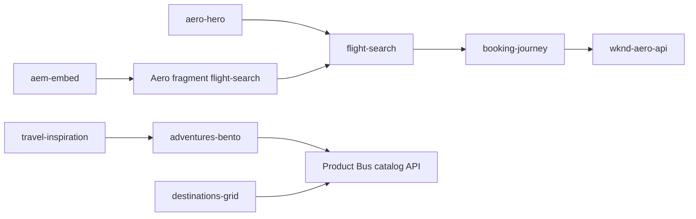

# WKND Aero — Block PRDs

Product requirements for each WKND Aero block, derived from the [WKND Aero Build Plan](../.cursor/plans/wknd_aero_build_plan_37c09bda.plan.md), [Figma design](https://www.figma.com/design/B2ELOOHZsCawD8MvjNT6od/WKND-Aero), and EDS skills:

| Skill | Applied to each PRD |
|-------|---------------------|
| [content-driven-development](.agents/skills/content-driven-development/SKILL.md) | Test content path before implementation |
| [content-modeling](.agents/skills/content-modeling/SKILL.md) | Authoring table contract |
| [analyze-and-plan](.agents/skills/analyze-and-plan/SKILL.md) | Acceptance criteria structure |
| [building-blocks](.agents/skills/building-blocks/SKILL.md) | Implementation constraints |
| [testing-blocks](.agents/skills/testing-blocks/SKILL.md) | Validation checklist |
| [ew-block-library](skills/ew-block-library/SKILL.md) | Library preview registration |

**Conventions**

- Aero blocks live under `blocks/aero/{block-name}/`; DA class remains `{block-name}`.
- Site: `wknd-aero` unless noted (`aem-embed` is `masterclass-demo` only).
- Breakpoints: mobile default, `min-width: 600px`, `900px`, `1200px`.
- Tokens: extend [`styles/brands/wknd-aero.css`](../styles/brands/wknd-aero.css) from [`styles/brand.css`](../styles/brand.css).

---

## PRD-01: `aero-header`

### Purpose

Site chrome for WKND Aero — logo, primary nav (BOOK, DESTINATIONS, WKND PASS, ADVENTURES), utility links (FLIGHT STATUS, SIGN IN). Replaces generic `header` block on Aero pages.

| Field | Value |
|-------|-------|
| Path | `blocks/aero/aero-header/` |
| Canonical model | **Standalone** (unique chrome) |
| Load phase | **Lazy** (global header; not LCP) |
| Reference | [`blocks/header/`](../blocks/header/header.js) |
| Figma | Nav bar on all desktop/mobile frames |

### Content model

| Row | Col 1 | Col 2 | Required |
|-----|-------|-------|----------|
| 1 | Logo image | Link to `/` | Yes |
| 2–6 | Nav label (uppercase) | Nav URL | Yes (min 4 links) |
| 7 | FLIGHT STATUS label | URL | Optional |
| 8 | SIGN IN label | URL | Optional |

**Variants (block classes):** none v1.

**Alternative:** Header content authored in `/nav` fragment only; block reads fragment via metadata — defer unless authors need per-page nav overrides.

### Functional requirements

- [ ] Sticky or static top bar per Figma (white bg, uppercase nav, bordered SIGN IN button)
- [ ] Mobile hamburger menu with focus trap, Escape to close, `aria-expanded` on toggle
- [ ] Active nav state for current section (URL match)
- [ ] Logo alt text from authored image metadata

### Edge cases

- [ ] Missing optional utility rows — hide FLIGHT STATUS / SIGN IN gracefully
- [ ] Fewer than 4 nav rows — still render without layout break
- [ ] Long nav labels — truncate or wrap on mobile without horizontal scroll on page

### Responsive

- [ ] Mobile (&lt;900px): hamburger, full-screen or slide-down panel
- [ ] Desktop (≥900px): horizontal nav, no hamburger

### Performance

- [ ] No extra font loads beyond global `head.html`
- [ ] CSS scoped `.aero-header`

### Accessibility

- [ ] `nav` landmark, skip-link compatible
- [ ] Keyboard nav through all links; visible focus

### Analytics

- [ ] `pushInteractionEvent` on SIGN IN and primary nav clicks (block name `aero-header`)

### Test content

- `drafts/wknd-aero/header-test.plain.html` + seeded `/nav` on `wknd-aero` DA

### Acceptance criteria

- [ ] Matches Figma header at 1280px and 390px
- [ ] `npm run lint` passes
- [ ] No console errors; mobile menu accessible

### Library

- [ ] `library/blocks-aero.json` entry; shell `blocks/aero/aero-header/aero-header.html`
- [ ] **Not** in Adventures/B2B libraries

---

## PRD-02: `aero-footer`

### Purpose

Site footer — logo, tagline, link columns (EXPLORE, RESOURCES, COMPANY), copyright, social icons.

| Field | Value |
|-------|-------|
| Path | `blocks/aero/aero-footer/` |
| Canonical model | **Standalone** |
| Load phase | **Lazy** |
| Figma | Footer on homepage desktop frame |

### Content model

| Row | Col 1 | Col 2 | Col 3 |
|-----|-------|-------|-------|
| 1 | Logo | Tagline (paragraph) | — |
| 2+ | Column heading | Link text | Link URL |

Repeat rows for each link (group by column heading in col 1). Max 3 column headings.

| Row (final) | Copyright text | — | — |

**Variants:** `dark` (default, charcoal bg), `light` (optional class).

### Functional requirements

- [ ] Three link columns on desktop; stacked on mobile
- [ ] External links open in same tab unless `target` authored
- [ ] Social icon row (globe, plane, share) — optional row with icon links

### Edge cases

- [ ] Empty column — omit column
- [ ] Missing copyright row — default `© {year} WKND VOYAGES`

### Responsive

- [ ] Mobile: single column stack
- [ ] Desktop: logo/tagline left, columns right (per Figma)

### Accessibility

- [ ] `footer` landmark; heading hierarchy for column titles (`h3` or `h4`)
- [ ] Icon-only links have `aria-label`

### Test content

- `drafts/wknd-aero/footer-test.plain.html`

### Acceptance criteria

- [ ] Visual match Figma footer; lint clean; keyboard accessible

---

## PRD-03: `aero-hero`

### Purpose

Full-bleed homepage hero — background image, headline with orange accent word, optional subcopy, **embedded `flight-search`** slot.

| Field | Value |
|-------|-------|
| Path | `blocks/aero/aero-hero/` |
| Canonical model | **Standalone** + composition |
| Load phase | **Eager** (LCP candidate) |
| Reference | [`blocks/hero-adventure/`](../blocks/hero-adventure/hero-adventure.js) |
| Figma | `Hero Section` desktop + mobile homepage |

### Content model

| Row | Col 1 | Col 2 |
|-----|-------|-------|
| 1 | Background image | — |
| 2 | Headline (use `**word**` or second cell for orange accent) | — |
| 3 | Subcopy (optional) | — |
| 4 | `flight-search` | (nested block table or placeholder row — see PRD-04) |

**Variants:** `compact` (shorter height, for `/destinations`); `no-search` (marketing-only hero).

### Functional requirements

- [ ] LCP image optimized (eager, `fetchpriority=high`, responsive `picture`)
- [ ] Gradient overlay per Figma
- [ ] Compose or mount `flight-search` below headline
- [ ] Semantic `<h1>` in hero content

### Edge cases

- [ ] Missing background image — solid dark fallback
- [ ] Missing subcopy — layout unchanged
- [ ] `compact` variant reduces min-height 50%

### Responsive

- [ ] Mobile: stacked headline, full-width search widget (Figma `Homepage (Mobile)`)
- [ ] Desktop: headline left-aligned over image, search bar full content width

### Performance

- [ ] Hero image is LCP; search JS may lazy-defer inside composed block
- [ ] Target zone optional: section metadata `targetlocation: aero-hero-cta`

### Accessibility

- [ ] `h1` once per page; contrast on headline over gradient ≥ 4.5:1

### Analytics

- [ ] Page template `homepage`; hero impression via page view

### Test content

- `drafts/wknd-aero/home.plain.html` (homepage seed)

### Acceptance criteria

- [ ] PSI LCP &lt; 2.5s on preview with hero image optimized
- [ ] Headline accent color `#e8651a`
- [ ] Search widget functional (redirect to `/book/flights`)

---

## PRD-04: `flight-search`

### Purpose

Flight search widget — FROM, TO, DATES, PASSENGERS, FIND FLIGHTS CTA. Used in `aero-hero`, Aero fragments for `<aem-embed>`, and standalone sections.

| Field | Value |
|-------|-------|
| Path | `blocks/aero/flight-search/` |
| Canonical model | **Configuration** + form UI |
| Load phase | **Eager** when in hero; **Lazy** in embed fragment |
| Figma | `Search Widget` in hero; mobile stacked fields |
| API | `GET {aero-api}/api/airports?q=` for autocomplete |

### Content model

| Row | Col 1 | Col 2 | Notes |
|-----|-------|-------|-------|
| 1 | Default origin IATA/city | — | Optional |
| 2 | Default destination IATA/city | — | Optional |
| 3 | Default passengers | — | Optional (1–9) |
| 4 | CTA label | — | Default `FIND FLIGHTS` |

Query params override authored defaults: `origin`, `dest`, `depart`, `return`, `pax`, `adv`, `cid`, `ref`.

**Variants:** `embed` (compact, for aem-embed shadow DOM — `:host` CSS).

### Functional requirements

- [ ] SSR-visible `<form>` with `<label>` + inputs (LLM/crawler friendly)
- [ ] JS enhances: airport autocomplete, date range picker, passenger stepper
- [ ] Submit builds URL: `/book/flights?origin=&dest=&depart=&return=&pax=&adv=&cid=&ref=`
- [ ] In embed context: `window.top.location.assign(...)` + dispatch `wknd:flight-search-start` on parent
- [ ] Validate IATA codes server-side not required v1; client format check only

### Edge cases

- [ ] Empty origin — default nearest hub or blank with validation message
- [ ] Invalid dates — inline error, no navigation
- [ ] API unavailable — free-text airports still submittable
- [ ] `suppressLoadPage` embed context — block decorates without full page shell

### Responsive

- [ ] Mobile: vertical stack of fields + full-width CTA
- [ ] Desktop: horizontal 5-column bar per Figma

### Performance

- [ ] Autocomplete debounced 300ms; no Preact
- [ ] `:host` token aliases in `.flight-search.embed` for shadow DOM

### Accessibility

- [ ] All fields labeled; errors linked via `aria-describedby`
- [ ] CTA is `<button type="submit">`

### Analytics

- [ ] `flightSearchStart` on Adventures (embed); `flightSearch` on Aero after redirect

### Test content

- `drafts/wknd-aero/flight-search.plain.html`
- Fragment `/fragments/flight-search` on wknd-aero DA

### Acceptance criteria

- [ ] Form visible without JS (degraded submit still navigates with GET params)
- [ ] Embed variant works in [Embed Simulator](https://main--helix-website--adobe.aem.page/docs/aem-embed)
- [ ] Attribution params preserved in redirect URL

---

## PRD-05: `adventures-bento`

### Purpose

Featured adventures bento grid — large feature, medium tile, small vertical tiles, promo card. Data from Product Bus catalog.

| Field | Value |
|-------|-------|
| Path | `blocks/aero/adventures-bento/` |
| Canonical model | **Configuration** (API-driven) + optional manual override rows |
| Load phase | **Lazy** |
| Figma | `Section - Featured Adventures (Bento Grid)` |
| Data | `GET {aero-api}/catalog/adventures/index.json` |

### Content model

**Config row (first non-image row):**

| Col 1 | Col 2 | Col 3 | Col 4 |
|-------|-------|-------|-------|
| Eyebrow (e.g. `CURATION 01`) | Heading | View-all link text | View-all URL |

**Optional filter row:**

| `source` | `product-bus` (default) | `limit` (4–6) | `category` (optional) |

**Manual override rows (optional, repeat):**

| Image | Title | Tag/badge | Description | CTA text | Adventure slug or URL |

When manual rows exist, they replace API tiles up to `limit`.

### Functional requirements

- [ ] Fetch catalog; map to bento slots (1 large, 1 medium, 2+ small per Figma)
- [ ] Tile CTAs: `/adventures/{slug}` and `/book/flights?dest={iata}&adv={slug}`
- [ ] Badge support (e.g. `TRENDING`)
- [ ] Loading skeleton; error state with retry

### Edge cases

- [ ] &lt; 4 catalog items — collapse grid gracefully
- [ ] Missing image — placeholder from brand palette
- [ ] API failure — show manual rows only or static fallback message
- [ ] Invalid slug in manual row — skip tile

### Responsive

- [ ] Mobile: single column cards
- [ ] Desktop: CSS grid bento layout per Figma proportions

### Performance

- [ ] Cache catalog response 5 min client-side
- [ ] Images lazy-loaded except first visible tile

### Accessibility

- [ ] Each tile is `<article>` with heading link; images have alt

### Analytics

- [ ] Click tracking on tiles (`adventureTileClick`, slug + position)

### Test content

- `drafts/wknd-aero/home.plain.html` with mock API or seeded catalog

### Acceptance criteria

- [ ] Bento matches Figma at 1280px and 390px
- [ ] Catalog-driven tiles match Product Bus entity fields
- [ ] View-all link works

---

## PRD-06: `aero-pass`

### Purpose

WKND Pass loyalty section — eyebrow, headline, benefit list with icons, CTA, membership card visual.

| Field | Value |
|-------|-------|
| Path | `blocks/aero/aero-pass/` |
| Canonical model | **Collection** (repeating benefit items) |
| Load phase | **Lazy** |
| Figma | `Section - WKND Pass Benefits` / mobile `WKND Pass Section` |

### Content model

| Row | Col 1 | Col 2 | Col 3 |
|-----|-------|-------|-------|
| 1 | Eyebrow | — | — |
| 2 | Headline (`h2`) | — | — |
| 3+ | Icon (image or emoji placeholder) | Benefit title | Benefit description |
| last | CTA text | CTA URL | — |
| optional | Card image | Status label | Status value (e.g. `BOARDING: NOW`) |

**Variants:** `deep-green` (dark bg default).

### Functional requirements

- [ ] Two-column layout: copy left, card visual right (desktop)
- [ ] Benefit list with orange icon accents
- [ ] CTA button primary orange

### Edge cases

- [ ] No benefits rows — hide list, show headline + CTA only
- [ ] Missing card image — CSS-only card mockup

### Responsive

- [ ] Mobile: stack copy then card visual (Figma mobile pass section)

### Target

- [ ] Section metadata `targetlocation: aero-pass-offer` on `/wknd-pass`

### Test content

- `drafts/wknd-aero/wknd-pass.plain.html`

### Acceptance criteria

- [ ] Three benefits from Figma copy render correctly
- [ ] Dark section contrast passes WCAG AA

---

## PRD-07: `aero-newsletter`

### Purpose

Email capture CTA — headline, subcopy, email field, subscribe action.

| Field | Value |
|-------|-------|
| Path | `blocks/aero/aero-newsletter/` |
| Canonical model | **Standalone** |
| Load phase | **Lazy** |
| Figma | `Section - Newsletter / CTA` |

### Content model

| Row | Col 1 | Col 2 |
|-----|-------|-------|
| 1 | Headline (`h2`) | — |
| 2 | Subcopy | — |
| 3 | Placeholder text | Submit label (default `SUBSCRIBE`) |
| 4 | Form action URL (optional) | — |

v1: demo — `preventDefault` + success message; optional POST to Worker later.

### Functional requirements

- [ ] Inline email + submit (underline style per Figma)
- [ ] Email validation before submit
- [ ] Success/error inline feedback

### Edge cases

- [ ] Empty action URL — client-only demo acknowledgment
- [ ] Invalid email — aria-live error

### Responsive

- [ ] Mobile: stacked; desktop: centered narrow column

### Accessibility

- [ ] `label` for email; submit button explicit name

### Analytics

- [ ] `newsletterSubmit` event (no PII in payload)

### Acceptance criteria

- [ ] Visual match Figma newsletter section
- [ ] Keyboard submittable

---

## PRD-08: `destinations-grid`

### Purpose

Explore destinations listing — filterable grid of adventure/destination cards from Product Bus.

| Field | Value |
|-------|-------|
| Path | `blocks/aero/destinations-grid/` |
| Canonical model | **Configuration** |
| Load phase | **Lazy** |
| Figma | `Explore Destinations` desktop + mobile |
| Data | Product Bus catalog index |

### Content model

| Row | Col 1 | Col 2 | Col 3 |
|-----|-------|-------|-------|
| 1 | Page eyebrow | Heading | Intro copy |
| 2 | `filter` | category slug or `all` | — |
| 3 | `limit` | number (default 12) | — |

### Functional requirements

- [ ] Uniform card grid (image, title, region, from-price, flight time hint)
- [ ] Optional category filter chips from row 2
- [ ] Card links to `/adventures/{slug}` and book CTA

### Edge cases

- [ ] Empty catalog — authored empty state message
- [ ] Filter yields zero — show “no destinations” state

### Responsive

- [ ] Mobile: 1 column; tablet: 2; desktop: 3–4 columns

### Performance

- [ ] Paginate or limit default 12; “load more” optional v2

### Acceptance criteria

- [ ] `/destinations` seed page renders full grid from catalog
- [ ] Filter by `adventureCategory` works when configured

---

## PRD-09: `travel-inspiration`

### Purpose

Editorial landing section — hero intro, mixed content rows, embedded `adventures-bento` or inline adventure picks.

| Field | Value |
|-------|-------|
| Path | `blocks/aero/travel-inspiration/` |
| Canonical model | **Collection** + **Configuration** hybrid |
| Load phase | **Lazy** |
| Figma | `Travel Inspiration` frames |

### Content model

| Row | Col 1 | Col 2 |
|-----|-------|-------|
| 1 | Eyebrow | — |
| 2 | Headline | — |
| 3 | Intro paragraph | — |
| 4+ | Image | Title + link (editorial picks) |
| config | `show-bento` | `true` / `false` |
| config | `bento-limit` | number |

### Functional requirements

- [ ] Editorial rows render as alternating feature rows
- [ ] When `show-bento=true`, fetch and render mini bento via shared `blocks/aero/_shared/catalog.js`
- [ ] Mix authored editorial with catalog-backed cards

### Edge cases

- [ ] No editorial rows — bento-only layout
- [ ] `show-bento=false` — editorial only

### Responsive

- [ ] Mobile: stacked features; desktop: alternating image/text

### Acceptance criteria

- [ ] `/travel-inspiration` seed matches Figma structure
- [ ] Bento subsection optional per config row

---

## PRD-10: `booking-journey`

### Purpose

Multi-step booking SPA — flight results, seat selection, passenger details, payment review, confirmation.

| Field | Value |
|-------|-------|
| Path | `blocks/aero/booking-journey/` |
| Canonical model | **Configuration** (shell only in DA) |
| Load phase | **Delayed** (Preact + importmap) |
| Figma | `Select Your Flight`, `Select Your Seats`, `Passenger Details`, `Payment & Review` (+ mobile) |
| API | `workers/wknd-aero-api` booking endpoints |

### Content model

| Row | Col 1 | Col 2 |
|-----|-------|-------|
| 1 | `journey-title` (optional page title override) | — |
| 2 | `aero-api` base URL | — (fallback: page metadata `aero-api`) |

All step UI is runtime — not authored per step.

**Page paths (content pages on wknd-aero):**

- `/book/flights`, `/book/seats`, `/book/passengers`, `/book/review`, `/book/confirmation`

Each contains single `booking-journey` block; router reads `window.location.pathname`.

### Functional requirements

- [ ] Preact router across 4 steps + confirmation
- [ ] State in `sessionStorage` (`wknd_booking_state`)
- [ ] Hydrate from query params on entry: `origin`, `dest`, `depart`, `return`, `pax`, `adv`, `cid`, `ref`
- [ ] Step 1: search results list, sort/filter, eco fare badges, WKND Pass upsell
- [ ] Step 2: seat map, select seats per passenger
- [ ] Step 3: passenger forms (demo PII, no real payment)
- [ ] Step 4: review + mock payment → `POST /api/bookings`
- [ ] Confirmation: booking ID, JSON-LD `FlightReservation`, `bookingComplete` analytics

### Edge cases

- [ ] Direct hit `/book/seats` without state — redirect to `/book/flights`
- [ ] Session expired — clear message + restart search
- [ ] API error — retry banner per step
- [ ] `adv`/`cid` persist through funnel in state + analytics

### Responsive

- [ ] Mobile: stacked flight cards, sticky summary bar (Figma mobile flight/seat/payment frames)
- [ ] Desktop: results list + sidebar summary

### Performance

- [ ] Preact loaded only on `/book/*` via `delayed.js` gate or block-level dynamic import
- [ ] No Preact on marketing pages
- [ ] Target zone `flight-results-upsell` on flights step only (`target: on` page metadata)

### Accessibility

- [ ] Step indicator with `aria-current="step"`
- [ ] Seat map keyboard selectable
- [ ] Form fields labeled; error summary on validation fail

### LLM / SEO

- [ ] Each step: visible `<h1>`, noscript fallback with support link
- [ ] Confirmation JSON-LD server-visible in DOM

### Test content

- `drafts/wknd-aero/book-flights.plain.html` + full journey seed paths

### Acceptance criteria

- [ ] End-to-end demo booking completes with confirmation ID
- [ ] Attribution `adv` on `bookingComplete` when started from embed
- [ ] Lint passes; no console errors per step
- [ ] Mobile 390px layout matches Figma flight card pattern

---

## PRD-11: `aem-embed` (Adventures consumer)

### Purpose

Thin EDS wrapper so Adventures authors embed Aero `flight-search` fragments via the [**AEM Embed Web Component**](https://main--helix-website--adobe.aem.page/docs/aem-embed).

| Field | Value |
|-------|-------|
| Path | `blocks/aem-embed/` (root — **not** under `blocks/aero/`) |
| Site | `masterclass-demo` (WKND Adventures) only |
| Canonical model | **Standalone** |
| Load phase | **Lazy** (`aem-embed.js` module) |

### Content model

| Row | Col 1 |
|-----|-------|
| 1 | Aero fragment URL (link cell) |

Example URL:

```
https://main--wknd-aero--znikolovski.aem.live/fragments/flight-search?dest=PUQ&adv=patagonia-peaks&cid=adv-patagonia-peaks&ref=wknd-adventures
```

Optional row 2: `height` (css min-height, default `auto`).

### Functional requirements

- [ ] `decorate()` validates URL host against allowlist (`wknd-aero`, `*.aem.live`, `*.aem.page`)
- [ ] Renders `<aem-embed url="...">` with sanitized URL (no javascript: URLs)
- [ ] Loads `scripts/aem-embed.js` once per page
- [ ] Listen for `wknd:flight-search-start` on `window`; push Adventures ACDL event

### Edge cases

- [ ] Missing URL — empty state with author hint
- [ ] Invalid host — block error message, no embed
- [ ] Aero CORS misconfigured — console warning + visible fallback link “Search flights on WKND Aero”

### Responsive

- [ ] Embed width 100% of content column; min-height from optional row

### Accessibility

- [ ] `title` attribute on `aem-embed` describing widget purpose

### Test content

- `drafts/blog/patagonia-trek-flight-embed.plain.html` on masterclass-demo
- Seed script `tools/scripts/seed-adventure-flight-embed.mjs`

### Acceptance criteria

- [ ] Embed renders in Adventures blog page on preview
- [ ] Search redirects top window to Aero with correct query params
- [ ] Adventures analytics receives `flightSearchStart` with `adv` + `dest`
- [ ] [Embed Simulator](https://main--helix-website--adobe.aem.page/docs/aem-embed) preview passes

### Library

- [ ] `library/blocks-adventures.json` only — **not** in Aero library

---

## Cross-block dependencies



| Dependency | Blocks affected |
|------------|-----------------|
| `scripts/aero-blocks.js` | All `blocks/aero/*` |
| Page metadata `aero-api` | `flight-search`, `adventures-bento`, `destinations-grid`, `booking-journey` |
| Product Bus ETL | `adventures-bento`, `destinations-grid`, pipeline `/adventures/*` |
| `styles/brands/wknd-aero.css` | All Aero blocks |
| `scripts/aem-embed.js` | `aem-embed` only |
| Aero `suppressLoadPage` | `flight-search` in fragments |

---

## Implementation order (recommended)

1. `flight-search` (unblocks hero, embed, booking)
2. `aero-header` / `aero-footer` (chrome)
3. `aero-hero` + `adventures-bento` (homepage MVP)
4. `aero-pass`, `aero-newsletter`, `destinations-grid`, `travel-inspiration`
5. `booking-journey`
6. `aem-embed` + Aero fragment + Adventures seed

---

## PRD checklist (per block, before PR)

Use [testing-blocks](.agents/skills/testing-blocks/SKILL.md) and [code-review](.agents/skills/code-review/SKILL.md):

- [ ] Test content exists (`drafts/` or wknd-aero DA)
- [ ] Content model documented in this file matches implementation
- [ ] `npm run lint` passes
- [ ] Browser validation at 390px + 1280px with screenshot or curl DOM check
- [ ] Library shell regenerated if block is in `library/blocks-aero.json` or `blocks-adventures.json`
- [ ] PR preview URL on `wknd-aero` or `masterclass-demo` as appropriate
