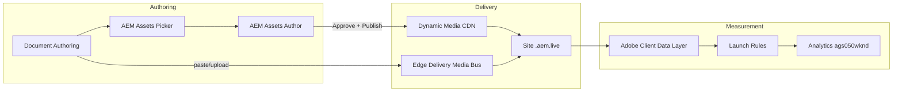

# Asset Analytics & Dynamic Media Plan — WKND Adventures

End-to-end plan to migrate images into **AEM Assets**, deliver via **Dynamic Media** and **Edge Delivery Media Bus**, and measure **top-performing assets** in Adobe Analytics (`ags050wknd`).

Related: [ANALYTICS-LAUNCH-PLAN.md](./ANALYTICS-LAUNCH-PLAN.md), [MARTECH.md](./MARTECH.md), [Media Bus & DAM](https://www.aem.live/docs/media).

---

## Current state

| Area | Status |
|------|--------|
| DA AEM Assets picker | `tools/aem-assets/aem-assets.js` + Sidekick library entry |
| Assets selector config | `tools/assets-selector/config.json` — `copyMode: reference` (DM delivery URLs) |
| AEM repository | `author-p115476-e1135027.adobeaemcloud.com` |
| Legacy image URLs | Many block previews still reference `wknd-adventures.com` |
| Responsive images | `scripts/media.js` — Media Bus **and** Dynamic Media paths |
| Asset tracking (code) | `scripts/asset-analytics.js` — ACDL `assetImpression` / `assetClick` |
| Launch rules for assets | **TODO** — see Phase 4 |

---

## Architecture



**Two delivery modes** (per [aem.live media docs](https://www.aem.live/docs/media)):

| Mode | Authoring | Runtime URL | Code path |
|------|-----------|-------------|-----------|
| **Media Bus** | DA paste / upload | Same-origin `./media_<hash>.png?width=` | `createOptimizedPicture` via `createResponsivePicture` |
| **Dynamic Media** | AEM Assets picker (`reference`) | DM delivery URL (`/is/image/…`) | `createDynamicMediaPicture` (`wid`, `qlt`, `fmt`) |

---

## Phase 1 — AEM Assets & Dynamic Media (Cloud Service)

**Owner:** AEM administrator / assets team.

### 1.1 Enable Dynamic Media Open API

1. AEM Assets → **Tools → Assets → Dynamic Media → General Settings** — confirm DM enabled.
2. Enable **Dynamic Media Open API** for the delivery environment.
3. Create or confirm a **Delivery** repository (Asset Selector shows **Delivery-** prefixed folders).

### 1.2 Processing profiles — when you need them

**Not required for your primary path** (DA + Asset Selector + `copyMode: reference` → Dynamic Media URLs). DM handles delivery-time transforms on its CDN; approve/publish to DM is what matters for that flow.

**You do need** an Edge Delivery processing profile if any of these apply ([UE Assets publishing](https://www.aem.live/docs/universal-editor-assets)):

| Scenario | Why |
|----------|-----|
| **Universal Editor** pages publish assets **with** the page to Edge Delivery (Media Bus sideload) | EDS enforces size/format limits; originals over ~20 MB or very large dimensions fail publish |
| **Large camera originals** uploaded to DAM | Profile creates `edge-delivery-services-jpeg` / `edge-delivery-services-png` renditions (max **2000×2000**) used instead of the original |
| **Video** heroes via AEM Assets | `edge-delivery-services-mp4` rendition for EDS-compatible MP4 |

If authors only insert **DM reference URLs** in DA and never rely on UE page+asset publish to Media Bus, you can skip processing profiles initially and add them later if you hit publish limit errors.

When you do create one, name renditions exactly `edge-delivery-services-jpeg` and `edge-delivery-services-png` (EDS looks up those names).

### 1.3 Folder structure & metadata

**Setup runbook:** [AEM-ASSETS-METADATA-SETUP.md](./AEM-ASSETS-METADATA-SETUP.md) (Assets View **Settings → Metadata Forms**, not legacy Admin UI).

Recommended DAM layout:

```
/content/dam/wknd-adventures/
  heroes/
  adventures/
  activities/
  magazine/
  blog/
  contributors/
```

Create folders via script:

```bash
export AEM_ACCESS_TOKEN="<IMS bearer from AEM author>"
node tools/aem-assets/setup-wknd-dam.mjs
```

Metadata form fields (minimum) — see `tools/aem-assets/wknd-adventures-metadata-form.spec.json`:

- `dc:title` — display / alt fallback
- `dc:description` — caption
- `wknd:adventureCategory` — aligns with page metadata and Analytics eVar4 segments
- `wknd:contentUsage` — multi-select: `["hero"]`, `["blog","card"]`, etc.
- `dam:assetStatus` — must be **Approved** before DM delivery

### 1.4 Publish workflow

1. Upload asset → processing profile runs.
2. Review → set **Approved**.
3. **Publish to Dynamic Media** (Manage Publication or workflow).
4. Verify delivery URL in Asset Selector (**Delivery-** view).

### 1.5 Path mapping (optional)

For AEM-authored pages under Universal Editor, map DAM to `/assets/` on the site ([path mapping](https://www.aem.live/developer/authoring-path-mapping)). DA-authored WKND content uses **reference URLs** from the picker — no path mapping required for DA-only pages.

---

## Phase 2 — Migrate existing images

### 2.1 Inventory

```bash
npm run inventory:images
```

Writes `tools/scripts/output/image-migration-inventory.json` — unique URLs, page references, classification (`external-legacy`, `media-bus`, etc.).

### 2.2 Migration steps

```bash
npm run inventory:images        # crawl live site
npm run migrate:manifest        # → tools/aem-assets/output/migration-manifest.json
npm run migrate:download        # stage binaries locally
export AEM_ACCESS_TOKEN="…"     # IMS bearer from AEM author
npm run migrate:upload          # Direct Binary Upload to DAM (see AEM-ASSETS-METADATA-SETUP.md)
```

Then:

1. Approve assets and **publish to Dynamic Media**.
2. `npm run migrate:resolve-delivery` — populate `deliveryUrl` in manifest.
3. `npm run migrate:replace-da -- --preview` — swap Media Bus URLs in DA content.
4. Re-preview and publish affected pages.

**Note:** `/adobe/assets/import/fromUrl` returns 404 on this Cloud Service program; use `migrate:upload` (initiateUpload protocol) or manual Assets View upload from `tools/aem-assets/staging/`.

### 2.3 Validation

- Preview page → view source: image `src` should be DM URL or `./media_<hash>`.
- Network tab: no requests to `wknd-adventures.com` on production.
- `data-asset-source` on images: `dynamic-media` or `media-bus` (see Phase 3).

---

## Phase 3 — Code (implemented)

### 3.1 `scripts/media.js`

- `getMediaSourceType(src)` — `dynamic-media` | `media-bus` | `aem-assets` | `external`
- `createResponsivePicture()` — branches to Media Bus or DM transforms
- `optimizePictures()` — post-decoration pass for blocks without custom JS (columns, teaser, etc.)
- Sets `data-asset-id`, `data-asset-source` on images for analytics

### 3.2 Blocks updated

- `hero-adventure`, `cards`, `cards-steps`, `carousel-blog` use `createResponsivePicture`
- All other blocks: `optimizePictures(main)` after sections load in `scripts.js`

### 3.3 Authoring

- Keep `tools/assets-selector/config.json` **`reference`** for DM delivery.
- Authors use **AEM Assets** in DA library (not the built-in DA "AEM Assets" name — use Sidekick entry **AEM Assets (WKND)**).

---

## Phase 4 — Analytics (Launch + Workspace)

### 4.1 ACDL events (from code)

| Event | When | Payload |
|-------|------|---------|
| `assetImpression` | Image ≥50% visible (once per image per page load) | `asset.assetId`, `asset.assetUrl`, `asset.assetName`, `asset.assetSource`, `asset.block` |
| `assetClick` | User clicks an image | Same |

Disable on pages with `analytics: off` metadata (asset analytics follows page analytics flag).

### 4.2 Report suite mapping (`ags050wknd`)

**Do not reuse eVar2** — it is **Internal Search Terms** per [ANALYTICS-LAUNCH-PLAN.md](./ANALYTICS-LAUNCH-PLAN.md). **Do not reuse event3/event4** — they are **Video Start / Video Complete** (YouTube block).

Use **new slots** (eVar6+ / prop6+ / event7+ are unallocated in the WKND plan):

| Slot | Description | Source | Notes |
|------|-------------|--------|-------|
| **eVar6** | Asset ID | `asset.assetId` | Stable key for Workspace rankings |
| **prop6** | Asset URL | `asset.assetUrl` | Only set on asset hits (leave **prop5** for CTA/carousel/link rules) |
| **prop7** | Asset source | `asset.assetSource` | `dynamic-media`, `media-bus`, `external`, … |
| **event7** | Asset Impression | `assetImpression` | Admin label: **Asset Impression** |
| **event8** | Asset Click | `assetClick` | Admin label: **Asset Click** |

Optional: **eVar2** only if you later implement on-site search and want search terms on those hits — keep it separate from asset tracking.

### 4.3 Launch rules (add to property)

Prerequisites: **Adobe Client Data Layer** extension installed ([ANALYTICS-LAUNCH-PLAN.md §3](./ANALYTICS-LAUNCH-PLAN.md#prerequisite-acdl-extension)) and **`EDS - Analytics Variable`** Web SDK data element created.

#### ACDL data elements (create first)

Extension: **Adobe Client Data Layer** · Type: **Data Layer Computed State** · Storage: **Page view**

| Data element name | ACDL path |
|-------------------|-----------|
| `EDS - Asset ID` | `asset.assetId` |
| `EDS - Asset URL` | `asset.assetUrl` |
| `EDS - Asset Source` | `asset.assetSource` |
| `EDS - Asset Block` | `asset.block` |

Verify in the browser console after scrolling an image into view:

```js
adobeDataLayer.getState('asset.assetId')
```

#### Event trigger (both rules use this pattern — not Core)

When adding the rule **Event**, use the **Adobe Client Data Layer** extension — **not** Core, **not** “Event Equals” (that option does not exist).

| UI field | Asset Impression rule | Asset Click rule |
|----------|----------------------|------------------|
| **Extension** | `Adobe Client Data Layer` | `Adobe Client Data Layer` |
| **Event type** (dropdown) | **`Listen to specific event`** | **`Listen to specific event`** |
| **Event name** (text field) | `assetImpression` | `assetClick` |
| **Scope** (dropdown) | `All` | `All` |

The **Event name** must match the string in `scripts/asset-analytics.js` exactly (case-sensitive). The site pushes:

```js
adobeDataLayer.push({ event: 'assetImpression', asset: { assetId, assetUrl, … } })
```

#### Rule: `EDS - Asset Impression`

1. **Rules → Add Rule** → name `EDS - Asset Impression`
2. **Event** — per table above (`assetImpression`)
3. **Action 1 — Update variable** (Web SDK):
   - Data element: **`EDS - Analytics Variable`**
   - **Custom Code:**

```js
content.__adobe = content.__adobe || {};
content.__adobe.analytics = content.__adobe.analytics || {};
const s = content.__adobe.analytics;
s.events = 'event7';
s.eVar6 = '%EDS - Asset ID%';
s.prop6 = '%EDS - Asset URL%';
s.prop7 = '%EDS - Asset Source%';
s.linkName = '%EDS - Asset ID%';
s.linkType = 'o';
```

4. **Action 2 — Send event** (Web SDK):
   - Type: **`Link click`** (`web.webInteraction.linkClicks`)
   - Instance: `alloy`
   - Data object: **`EDS - Analytics Variable`**

#### Rule: `EDS - Asset Click`

Same as impression, except:

- Event name: `assetClick`
- Custom Code uses `s.events = 'event8';`

#### Troubleshooting

| Problem | Fix |
|---------|-----|
| Rule never fires | Wait ≥5 s after load (Launch loads in delayed phase); confirm ACDL extension object name is `adobeDataLayer` |
| Wrong extension selected | **Core → Click** will not see `assetImpression` — switch to **Adobe Client Data Layer** |
| `%EDS - Asset ID%` empty | Scroll image ≥50% into view; check `adobeDataLayer.getState('asset')` in console |
| event7 not in Real-Time | Confirm Admin renamed Custom Event 7 → **Asset Impression** on `ags050wknd` |

### 4.4 Workspace — top performing assets

**Freeform table:**

- Rows: **eVar6 (Asset ID)** or **prop6 (Asset URL)**
- Columns: **Asset Impressions (event7)**, **Asset Clicks (event8)**, **CTR** (calculated metric)
- Filter: `prop7 = dynamic-media` (optional DM-only view)

**Segment ideas:**

- Hero assets only — `asset.block` contains `hero`
- DM vs Media Bus — `prop7` equals `dynamic-media` / `media-bus`

### 4.5 Operational Telemetry (supplemental)

Edge Delivery **viewmedia** checkpoint (via RUM) also records visible media URLs — sampled, not session-based. Use for performance ops; use **Analytics asset events** for ranking and CTR.

---

## Phase 5 — Checklist

- [ ] DM Open API enabled; Delivery repository visible in Asset Selector
- [ ] Processing profiles assigned (only if using UE publish or oversized originals); test asset approved & published to DM
- [ ] Run `npm run inventory:images`; migrate legacy `wknd-adventures.com` URLs
- [ ] Authors re-insert DM assets on high-traffic pages
- [ ] Launch rules for `assetImpression` / `assetClick` published
- [ ] Admin: label eVar6, prop6, prop7, event7, event8 in `ags050wknd` (leave eVar2 as Internal Search Terms)
- [ ] Workspace dashboard: Top Assets table
- [ ] Validate in Real-Time: trigger impression (scroll to image) and click

---

## Quick validation

```javascript
// Browser console after page load
window.adobeDataLayer.filter((e) => e.event?.startsWith('asset'));
document.querySelector('main img')?.dataset; // assetId, assetSource
```

```bash
# Image inventory
npm run inventory:images

# Traffic still uses real browsers (separate from asset analytics)
npm run simulate:traffic:dry -- --hits=10
```
