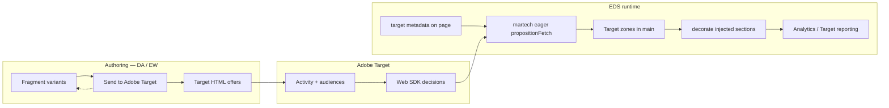

# Adobe Target personalization — WKND Adventures (EDS)

End-to-end plan for **fragment-based HTML offers**, **performance-safe delivery** via the [aem-martech](https://github.com/adobe-rnd/aem-martech) plugin, and **agent-assisted** workflows in Claude (Target MCP) and Experience Workspace (skills only).

## Architecture



| Layer | Responsibility |
|-------|----------------|
| **Content (DA)** | Source of truth for offer HTML; fragments per variant |
| **Send to Target** | Export preview `<main>` HTML as immutable offers |
| **Target** | Activities, audiences, traffic allocation |
| **EDS code** | Opt-in delivery (`target: on`), zone markers, post-injection decoration |
| **martech** | Eager `propositionFetch` before LCP paint; lazy analytics |
| **Launch** | Map ACDL / Web SDK hits (optional `prop9=target-on` QA flag) |

Official references:

- [Send to Adobe Target (DA)](https://docs.da.live/administrators/guides/prepare-menu/send-to-adobe-target)
- [Martech integration](https://www.aem.live/developer/martech-integration)
- [Fragments](https://www.aem.live/docs/fragments)
- [Web SDK personalization](https://experienceleague.adobe.com/en/docs/experience-platform/web-sdk/personalization/rendering-personalization-content)

---

## Performance rules (non-negotiable)

From DA delivery guidance and this project's martech setup:

1. **Opt in per page** — Page metadata `Adobe Target` = **On** only on pages with live activities. All other pages skip eager personalization (protects LCP).
2. **HTML offers, not fragment URLs** — Export full section HTML to Target. Do not deliver `/fragments/...` links and fetch client-side (chaining kills performance).
3. **Zones under `main`** — Mark sections with **Target zone** + **Target location ID** in section metadata. Activities target `#hero-mbox` (or `main .section.target#hero-mbox`).
4. **Web SDK via martech, not at.js** — Self-hosted `alloy` in eager phase when `target: on`; analytics deferred to lazy phase.
5. **Preload** — `head.html` preloads martech + `preconnect` to `edge.adobedc.net`.
6. **Consent** — `updateUserConsent({ personalize: true })` only when CMP allows (preview hosts auto-consent for QA).
7. **PSI gate** — Run PageSpeed on experiment pages before promoting activities to production traffic.

---

## One-time setup (admin)

### 1. Adobe Target API (authoring)

1. [Adobe Developer Console](https://developer.adobe.com/console) → project → **Adobe Target API** → service account.
2. Note **Tenant**, **Client ID**, **Client Secret**.
3. In DA: `https://da.live/#/znikolovski/masterclass-demo/.da` → sheet **`adobe-target`**:

   | key | value |
   |-----|-------|
   | tenant | *Target tenant name* |
   | clientId | *from console* |
   | clientSecret | *from console* |

   Do **not** preview or publish this sheet.

### 2. Experience Workspace library

Run once (or after library changes):

```bash
npm run library:setup
```

Registers **Send to Adobe Target** → `tools/adobe-target/adobe-target.html` on the preview host.

### 3. Datastream + Launch

Already configured in [`scripts/martech-config.js`](../scripts/martech-config.js). Confirm:

- Datastream includes **Adobe Target**
- Launch Web SDK extension: **Use self-hosted alloy.js** · instance name **`alloy`**
- **Migrate Target from at.js**: Off

See [MARTECH.md](./MARTECH.md) and [ANALYTICS-LAUNCH-PLAN.md](./ANALYTICS-LAUNCH-PLAN.md).

### 4. Target property settings

In Target admin:

- Disable **Page load enabled (Auto-create global mbox)** if you use explicit zones (recommended for EDS).
- Use **Form-based** or **API** experiences with CSS selectors matching your **Target location ID**.

---

## Human workflow — fragment offers to live test

### Step 1 — Create variant fragments

1. Open Experience Workspace → site `masterclass-demo`.
2. Create fragments under `/fragments/`, e.g.:
   - `/fragments/hero-default`
   - `/fragments/hero-climbing`
   - `/fragments/hero-trekking`
3. Build each with normal blocks (hero, columns, CTA, etc.).
4. **Preview** each fragment.

### Step 2 — Export offers

For each fragment:

1. Open the fragment in EW.
2. **Library → Send to Adobe Target**.
3. Name clearly, e.g. `WKND Hero — Climbing`.
4. **Create offer** (or **Update offer**).
5. Confirm metadata stores `adobe.target.offerId` on the document.

CLI alternative (Cursor / local, not EW):

```bash
npm run target:send -- --path /fragments/hero-climbing --name "WKND Hero — Climbing"
```

Requires `/.da/adobe-target` credentials and `da-auth` token in `.hlx/.da-token.json`.

### Step 3 — Place a Target zone on the page

On the page to personalize (e.g. `/`):

1. Add a **section** with default content (fragment block → `hero-default`).
2. Add **Section metadata** to that section:
   - **Target zone**: On
   - **Target location ID**: `hero-mbox`
3. Page metadata → **Adobe Target**: **On** (only while testing/live).

### Step 4 — Create Target activity

In [Adobe Target](https://experience.adobe.com/target):

1. **Activities → Create** → A/B Test or Experience Targeting.
2. **Location**: CSS selector `#hero-mbox` (or `main > .section.target#hero-mbox`).
3. **Experiences**: assign exported HTML offers (control = default, variants = climbing/trekking).
4. **Audiences**: use Analytics segments from Tier 4 archetypes (see [ANALYTICS-LAUNCH-PLAN.md](./ANALYTICS-LAUNCH-PLAN.md)).
5. QA on preview: `https://main--masterclass-demo--znikolovski.aem.page/?at_preview_token=...`

### Step 5 — Validate

- [ ] Zone has class `target` and id `hero-mbox` in DOM
- [ ] Injected blocks decorate (images, carousels work)
- [ ] No layout shift beyond martech timeout (1s default)
- [ ] Target reporting shows impressions
- [ ] PageSpeed ≥ 90 on experiment URL (or document waiver)
- [ ] Turn **Adobe Target** metadata **Off** when activity ends

### Step 6 — Promote

1. Activate activity in Target production workspace.
2. Publish CMS content if needed.
3. Monitor Target + Analytics for archetype breakdowns.

---

## Code reference (already in repo)

| File | Role |
|------|------|
| [`scripts/scripts.js`](../scripts/scripts.js) | Eager martech when `target: on`; zone decoration |
| [`scripts/target-delivery.js`](../scripts/target-delivery.js) | Re-decorate sections after Target injection |
| [`scripts/target-analytics.js`](../scripts/target-analytics.js) | ACDL `target` context + `targetZoneReady` |
| [`blocks/section-metadata/section-metadata.js`](../blocks/section-metadata/section-metadata.js) | Applies `target` class + section `id` |
| [`tools/adobe-target/`](../tools/adobe-target/) | EW extension + CLI |
| [`component-models.json`](../component-models.json) | Page `target` + section Target zone fields |

---

## Launch / Analytics (optional QA)

| Signal | Source |
|--------|--------|
| `page.targetEnabled` | `yes` when page metadata Target = On |
| `prop9` | `target-on` on Web SDK hits for QA filters |
| `event: targetZoneReady` | Fires when a zone is present (map to event16 if desired) |
| Target impressions | Primary reporting in **Target** + Analytics for Target |

Segment **WKND - Target Test Audience** (Analytics): visitors on pages with Target enabled — see [ANALYTICS-LAUNCH-PLAN.md](./ANALYTICS-LAUNCH-PLAN.md) Tier 6.

---

## Claude workflow (Target MCP)

Use skill: [`.claude/skills/adobe-target-personalization/SKILL.md`](../.claude/skills/adobe-target-personalization/SKILL.md)

**You have:** Target MCP, repo access, `npm run target:send`, git/PR flow.

**Typical prompt:**

> Create an A/B test on the homepage hero for Climbing vs Trekking seekers. We already exported offers `WKND Hero — Climbing` and `WKND Hero — Default`. Page has zone `#hero-mbox` and `target: on`.

**Agent checklist:**

1. Confirm offers exist in Target (MCP list offers / search by name).
2. Confirm page preview URL and zone selector `#hero-mbox`.
3. Create or update activity via MCP (location, experiences, audience from Tier 4).
4. Return preview QA URL with `at_preview_token` instructions.
5. Remind author to set page metadata **Adobe Target = On**.
6. After QA, document PSI result and activation steps.

**Do not:** paste `clientSecret`, bypass `target: on` on all pages, or deliver fragment URLs instead of HTML offers.

---

## Experience Workspace workflow (skills only)

Use skill: [`skills/ew-send-to-adobe-target/SKILL.md`](../skills/ew-send-to-adobe-target/SKILL.md)

**EW agent has:** user's IMS session, Library extension, coaching.

**EW agent does not have:** shell, Target MCP, `da-auth`, repo edits.

**Division of labor:**

| Task | Where |
|------|-------|
| Create/edit fragments | EW author |
| Export / update offers | EW → Library → Send to Adobe Target |
| Set Target zone metadata | EW author (section metadata fields) |
| Enable page `target: on` | EW author (page metadata) |
| Create Target activity | Claude + Target MCP **or** human in Target UI |
| Code / decoration fixes | Cursor / Claude in repo |

**EW prompt example:**

> I need to personalize the homepage hero for climbing visitors. Walk me through exporting my `/fragments/hero-climbing` fragment and setting up the page zone.

EW agent: confirm preview → Library → Send to Adobe Target → section metadata `target-zone` / `target-id` → page metadata Target On → hand off activity creation to Target UI or Claude.

---

## Troubleshooting

| Symptom | Fix |
|---------|-----|
| Default content only, no swap | Page metadata Target not **On**; activity inactive; wrong selector |
| Unstyled injected HTML | Wait for code sync; `target-delivery.js` should run — check console errors |
| Flicker / slow LCP | Turn Target **Off** on pages without activities; reduce offer weight |
| Extension can't load config | Fix `/.da/adobe-target` sheet |
| Offer update ignored | Use **Update offer** in EW; don't edit HTML inside Target |
| Activity can't delete offer | Remove activity association in Target first |

---

## Related docs

- [MARTECH.md](./MARTECH.md) — runtime martech setup
- [ANALYTICS-LAUNCH-PLAN.md](./ANALYTICS-LAUNCH-PLAN.md) — segments for audiences
- [FORM-ANALYTICS-PLAN.md](./FORM-ANALYTICS-PLAN.md) — event slot allocation (avoid collision)
